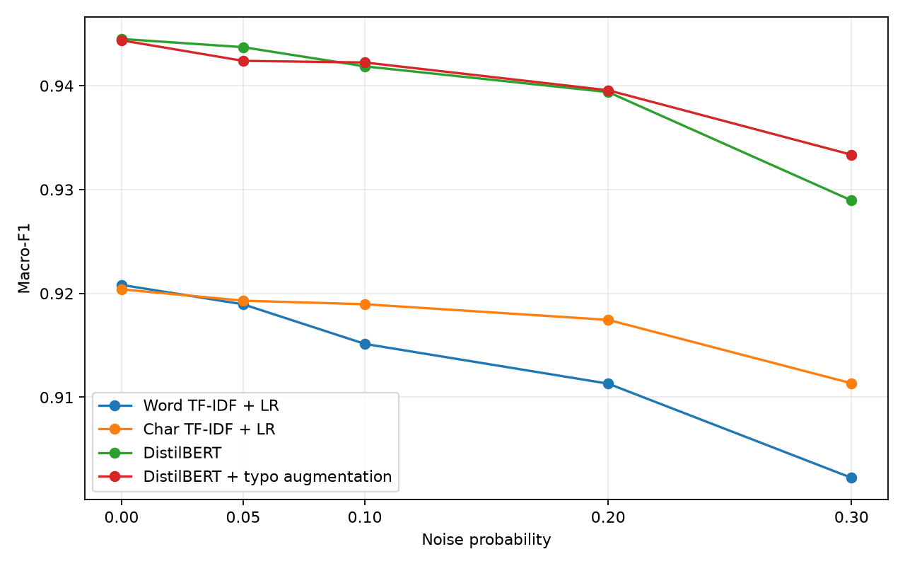

# How Robust Are Text Classifiers to Typographical Noise?

Final project for an NLP course.

## Idea

Compare Word TF-IDF + Logistic Regression, Character TF-IDF + Logistic Regression,
DistilBERT, and DistilBERT with typo augmentation on AG News. Synthetic typos are
character deletion, adjacent swap, keyboard substitution, and duplication.

## Dataset

AG News has four classes: World, Sports, Business, and Sci/Tech. A stratified split
with seed 42 gives 110,000 training and 10,000 validation examples; the original
7,600 test examples are held out. All models share these splits and noisy tests.

## Run

```bash
pip install -r requirements.txt
python main.py
```

The first run downloads AG News and distilbert-base-uncased. Training uses CUDA,
then MPS, then CPU depending on availability. Two three-epoch Transformer runs
can take considerable time. Completed models are reused from `checkpoints/`;
delete that directory to retrain. Seed 42 controls splitting, noise and training;
floating-point results may vary across devices or library versions.
The dependencies are pinned to the versions installed for this run (Python 3.14.2).
Local hardware is an Apple M4 Pro with 24 GB memory; TF-IDF uses CPU and
DistilBERT uses MPS. The requested SAGA solver and model hyperparameters are retained.

Augmentation is generated once: each training example has a 50% chance of being
corrupted with a uniformly sampled probability from 0.05 to 0.20. Validation stays
clean; the final epoch is evaluated without hyperparameter tuning. Test noise is
generated once and reused. Macro-F1 and retention are reported on a 0–1 scale.

## Results

<!-- RESULTS START -->
Macro-F1 (0–1 scale):

| Model | 0% | 5% | 10% | 20% | 30% |
|---|---:|---:|---:|---:|---:|
| Word TF-IDF + LR | 0.9208 | 0.9189 | 0.9151 | 0.9113 | 0.9022 |
| Char TF-IDF + LR | 0.9204 | 0.9193 | 0.9190 | 0.9175 | 0.9113 |
| DistilBERT | 0.9445 | 0.9437 | 0.9419 | 0.9394 | 0.9289 |
| DistilBERT + typo augmentation | 0.9444 | 0.9424 | 0.9422 | 0.9396 | 0.9334 |
<!-- RESULTS END -->

## Plot



## Files

- `main.py` — training, evaluation, and report generation
- `noise.py` — typo generation
- `results/` — measured metrics and plot
